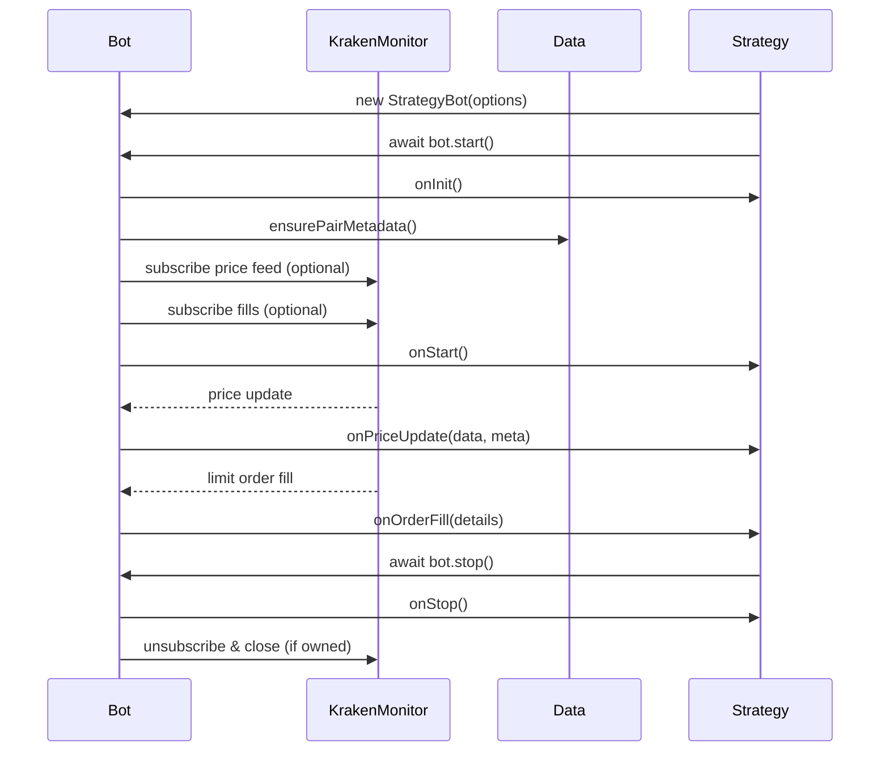

# Kraken GPT Bot – Developer Guide

Welcome! This guide explains how to build Kraken trading bots on top of the `Bot` class found in `gpt-bot/Bot.js`. It walks through environment requirements, configuration, subclassing, available helpers, and common workflows so you can focus entirely on strategy logic.

---

## 1. Environment & Installation

### 1.1. System Requirements
- Node.js 18+ (async/await, `fetch`, Intl APIs).
- Kraken API credentials with trading permissions (`KRAKEN_API_KEY`, `KRAKEN_API_SECRET`).
- Network connectivity to `api.kraken.com` and Kraken WebSocket endpoints.

### 1.2. Project Setup

```bash
# Inside the repository root
cd krakenbot/gpt-bot
npm install
```

All shared utilities (`libs/Data`, `libs/KrakenMonitor`, `libs/DataTools`, etc.) are bundled with the project—no extra packages required.

### 1.3. Environment Variables

Set your Kraken credentials before running any bot:

```bash
export KRAKEN_API_KEY="your-key"
export KRAKEN_API_SECRET="your-secret"
```

When testing strategies or developing without hitting the live API, enable dry-run mode (explained in §3.2).

---

## 2. Bot Class Overview

File: `gpt-bot/Bot.js`

The `Bot` class is a reusable foundation that handles:

- Kraken REST client (`libs/Data`) and WebSocket monitor (`libs/KrakenMonitor`) wiring.
- Trading pair normalisation (e.g. `DOGEUSD`, `DOGE/USD`, `dogeusd` are equivalent).
- Price feed subscriptions with optional threshold notifications.
- Limit order fill subscriptions.
- Precision helpers for price/volume rounding based on Kraken metadata.
- Convenience wrappers for market/limit orders, cancellations, balances, and open order summaries.
- Lifecycle hooks (`onInit`, `onStart`, `onStop`, `onPriceUpdate`, `onOrderFill`) to implement your trading logic.
- `EventEmitter` to allow observers (e.g. external loggers) to react to lifecycle events.

The base class is designed for subclassing—your strategy lives in an extended class that overrides hooks and optionally adds new behaviour.

---

## 3. Configuration Options

Instantiate a bot by passing an options object to the constructor. All options are optional; unspecified fields fall back to sensible defaults.

| Option | Type | Default | Purpose |
| --- | --- | --- | --- |
| `pair` | `string` | `'XBT/USD'` | Trading pair. Supports inputs like `DOGEUSD`, `DOGE/USD`, `dogeusd`. |
| `candleInterval` | `number` | `1` | Interval (minutes) for historical data pulls via `DataTools`. |
| `priceInterval` | `number \| null` | `null` | Interval used for WebSocket OHLC feed. Falls back to `candleInterval` if `null`. |
| `autoLoadPairInfo` | `boolean` | `true` | Fetch pair metadata (precision, minimum order size) during `start()`. Required for order helpers. |
| `autoStartPriceFeed` | `boolean` | `true` | Automatically subscribe to OHLC updates when `start()` is called. |
| `autoSubscribeOrderFills` | `boolean` | `false` | Subscribe to private executions feed. Requires authenticated WebSocket support. |
| `priceChangeThreshold` | `number \| null` | `null` | Percent threshold that triggers `thresholdTriggered = true` in `onPriceUpdate`. |
| `priceMonitoringPeriod` | `number` | `5` | Sliding window (minutes) used by `KrakenMonitor` to evaluate price-change thresholds. |
| `enforcePrecision` | `boolean` | `true` | When true, price/volume inputs are rounded to Kraken precision via `applyPricePrecision` / `applyVolumePrecision`. |
| `dryRun` | `boolean` | `false` | When true, orders are logged and emitted but never sent to Kraken. |
| `monitorOptions` | `object` | `{}` | Extra options forwarded to `new KrakenMonitor()` (URL overrides, logger, etc.). |
| `dataClient` | `Data` | `null` | Inject a custom Data client (e.g. mocked API for tests). |
| `monitor` | `KrakenMonitor` | `null` | Inject an existing monitor instance if you want multiple bots sharing a connection. |
| `logger` | `{ info, warn, error, debug }` | `console` | Override built-in logging. Only methods you supply are used; missing ones fall back to console. |

### 3.1. Pair Normalisation
Whatever format you provide for `pair`, the base class stores:
- `this.wsPair` – WebSocket symbol with slash (e.g. `DOGE/USD`).
- `this.restPair` – REST symbol without slash (e.g. `DOGEUSD`).
- `this.baseAsset` / `this.quoteAsset`.

### 3.2. Dry Run Mode
Set `dryRun: true` to log `AddOrder` payloads instead of submitting them. Useful for strategy debugging or running examples without funds. Dry-run responses contain `{ dryRun: true, payload }`.

---

## 4. Lifecycle Flow



### 4.1. Hooks to Override

```js
class MyBot extends Bot {
  async onInit() {
    // called before automatic subscriptions start
  }

  async onStart() {
    // called once subscriptions are active
  }

  async onPriceUpdate(priceData, meta) {
    // respond to ticks. meta.thresholdTriggered signals large moves.
  }

  async onOrderFill(details) {
    // handle fills from private executions feed
  }

  async onStop() {
    // cleanup resources not managed by the base class
  }
}
```

Hooks can be `async`; errors are caught, logged via `logger.error`, and emitted as `error` events (`this.emit('error', { hook, error })`).

### 4.2. Start / Stop

```js
const bot = new MyBot({ pair: 'ETH/USD' });
await bot.start();   // idempotent
// ...
await bot.stop();    // removes subscriptions and (optionally) closes the monitor
```

When you rely on external monitors or share one across bots, pass `monitor` in the constructor so `Bot` won’t close it at stop time.

---

## 5. Strategy Helpers

### 5.1. Market & Limit Orders

```js
await this.marketBuy(0.5);                         // buy 0.5 ETH at market
await this.marketSell(0.2);                        // sell 0.2 ETH at market
await this.limitBuy(1800, 0.1);                    // bid 0.1 ETH @ $1800
await this.limitSell(2000, 0.1, { timeinforce: 'GTC' });
await this.cancelLimitOrder('TXID');               // cancel a specific order
await this.cancelLimitOrder(['TXID1', 'TXID2']);   // cancel multiple IDs
await this.cancelAllOrders();                      // convenience helper
```

All order functions:
- Auto-fetch pair metadata (precision, minimum order size) the first time they run.
- Enforce precision if `enforcePrecision` is true.
- Respect `dryRun`.
- Emit `order:submitted` after execution/dry-run.

### 5.2. Price & Balance Utilities

```js
const ticker = await this.fetchTicker();     // last price, bid/ask, volume etc.
const latestCandle = await this.fetchLatestPrice(); // { o, h, l, c, v }
const balances = await this.fetchBalances(); // { ZUSD: "1000.00", XETH: "1.234" }
```

### 5.3. Open Order Snapshot

```js
const openOrders = await this.fetchOpenOrders();
console.log(openOrders.summary);   // { total, buy, sell }
console.log(openOrders.totals);    // aggregated value/quantity per side
console.log(openOrders.buy[0]);    // highest bid
```

`fetchOpenOrders` returns normalised entries with distance from the reference price (auto-inferred from ticker if not supplied).

### 5.4. Order Book Subscription

```js
const unsubscribe = this.watchOrderBook((snapshot) => {
  // snapshot.bids / snapshot.asks from KrakenMonitor
});
// later
unsubscribe();
```

Internally registers with `KrakenMonitor.onOrderBook` and automatically tracks the subscription for cleanup.

---

## 6. EventEmitter Signals

Beyond lifecycle hooks, you can subscribe to the underlying events:

| Event | Payload |
| --- | --- |
| `start` | `{ pair }` |
| `stop` | `{ pair }` |
| `price` | `(priceData, meta)` |
| `fill` | `(executionDetails)` |
| `order:submitted` | `{ payload, response?, dryRun? }` |
| `error` | `{ hook, error }` |

Example:

```js
bot.on('price', (data, meta) => {
  console.log('tick', meta.pair, data.close);
});
```

---

## 7. Subclassing Example

See `gpt-bot/test-bot.js` for a complete sample. Core pattern:

```js
const Bot = require('./Bot');

class MomentumBot extends Bot {
  async onInit() {
    this.window = [];
  }

  async onPriceUpdate(priceData) {
    this.window.push(priceData.close);
    if (this.window.length > 10) {
      this.window.shift();
    }
    // Strategy logic goes here...
  }
}

(async () => {
  const bot = new MomentumBot({
    pair: 'DOGE/USD',
    dryRun: true,
    priceChangeThreshold: 0.25
  });
  await bot.start();
})();
```

---

## 8. Using DataTools and Market Intelligence

`this.tools` exposes advanced analytics sourced from Kraken REST data:

- `await this.tools.getprice()` – Latest OHLC candle.
- `await this.tools.getPriceRange(60)` – High/low within last 60 minutes.
- `await this.tools.getVolatilityRange(120, 5)` – Average high-low range of 5-candle windows inside a 120-minute lookback.
- `await this.tools.getLinearRegression(240)` – Regression slope and intercept for 240-minute window.
- `await this.tools.getMarketCycle(360)` – Market cycle analysis (see `libs/MarketCycle.js` for details).

These helpers make it easy to build strategies that require historical context without duplicating REST plumbing.

---

## 9. Error Handling & Logging

- Hook errors are logged and re-emitted via `error` events.
- All Kraken request failures propagate as `Error` objects with original API messages.
- You can override the logger via the `logger` option; only provided methods are used. For example, plug in `pino`, `winston`, or a custom metrics collector.
- When running multiple bots, consider namespacing logs (e.g., wrapper logger that prefixes messages with bot ID).

---

## 10. Testing Strategies

1. **Dry Run First:** Always start with `dryRun: true` to verify order generation and event flow.
2. **Unit Test Hooks:** Export strategy helpers (pure functions) for unit testing. Use dependency injection (`dataClient`, `monitor`) to supply mocks.
3. **Replay Historical Data:** You can craft tests that push synthetic price ticks into `onPriceUpdate` by overriding `_subscribePriceFeed` or manually invoking the hook.
4. **Monitor Logs:** `DEBUG=1 node your-bot.js` enables extra WebSocket logs if your custom logger routes `debug`.

---

## 11. Deployment Notes

- Keep API keys secret; never commit `.env` files.
- Wrap bot start-up in a process manager (e.g. PM2, systemd) for resilience.
- Implement your own risk controls inside hooks (max exposure, drawdown stops, etc.).
- Ensure you comply with Kraken rate limits and account minimums.
- Watch for network disconnects; `KrakenMonitor` auto-reconnects by default.

---

## 12. Reference

Key files to consult:

| File | What it provides |
| --- | --- |
| `gpt-bot/Bot.js` | Base class described in this guide. |
| `gpt-bot/test-bot.js` | Demo bot showing subclassing, dry-run orders, and graceful shutdown. |
| `gpt-bot/libs/Data.js` | REST client for Kraken public/private endpoints. |
| `gpt-bot/libs/KrakenMonitor.js` | WebSocket manager for OHLC, order book, and execution feeds. |
| `gpt-bot/libs/DataTools.js` | Higher-level analytical helpers for price ranges, volatility, regression, market cycle. |

---

Happy building, and may your spreads be ever in your favor! If you extend the base Bot with reusable helpers, consider documenting them here to keep the toolkit consistent for all Kraken bots in this workspace.  

*Last updated: 2025-10-21*
